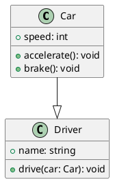

+++
title = "Hugo + PlantUML + GitHub/Actionsで画像に変更して表示する"
date = 2023-08-27T13:30:39+09:00
tags = ["hugo","github","actions","plantuml"]
draft = false
toc = false
backtotop = false
+++

# Title
PlantUMLのダイアグラムを生成し、それを画像として保存し、アーティファクトとして管理する


<!-- toc -->

## Contents
GitHub Actionsを使用してPlantUMLを画像に変換し、生成された成果物をアップロードするための手順を示します。

##### ディレクトリ構成
```directory
├── content
│   ├── posts
│   |    └── plantuml
│   │         ├── test.puml
│   │         └── test.png ①test.pumlから画像に変換(plantuml.yml)
│   └── images
│         └── plantuml
│             └── test.png ③成果物をダウンロード(hugo.yml)
├── artifact
│   └── test.png ②成果物として保存(plantuml.yml)
```

##### 手順

1. GitHub Actionsワークフローファイルの設定:
    * PlantUMLの画像を生成しアップロードするためのワークフローファイル（例: .github/workflows/plantuml.yml）を作成します。

```yaml:plantuml.yml
name: PlantUML to Image and Artifact

on:
  push:
    paths:
      - '.github/workflows/plantuml.yml'
      - 'content/plantuml/*.puml'
  # Allows you to run this workflow manually from the Actions tab
  workflow_dispatch:

env:
  PLANT_UML_PATH: content/plantuml　
  IMGES_PATH: content/images
  ARTIFACT: artifact

# Default to bash
defaults:
  run:
    shell: bash

jobs:

  # Build job
  build:
    runs-on: ubuntu-latest

    steps:
      - name: Checkout
        uses: actions/checkout@v3
      - name: Generate PlantUML Diagrams
        uses: holowinski/plantuml-github-action@main
        with:
          args: -v -tpng  ${PLANT_UML_PATH}/*.puml
      - name: Create Destination Folder
        run: mkdir -p ${ARTIFACT}  # フォルダを作成  
      - name: Copy Files
        run: cp ${PLANT_UML_PATH}/*.png ${ARTIFACT}/  # ファイルをコピー
      - name: Upload artifact
        uses: actions/upload-artifact@v3
        with:
          name: plant-uml-image
          path: |
            ${{ github.workspace }}/artifact
          if-no-files-found: error # 'warn' or 'ignore' are also available, defaults to `warn`
```

* 上記のワークフローファイルは、holowinski/plantuml-github-action@mainアクションを使用してPlantUMLを画像に変換し、contents/plantuml/ ディレクトリに生成された画像をartifact/にコピーして保存します。その後、actions/upload-artifact@v2 アクションを使用して artifact/ ディレクトリ内の成果物をアップロードします。

2. PlantUMLを作成します。
    * /content/post/plantuml/にtest.pumlを作成します。



3. Hugoワークフローの設定
    * Hugoビルド用のワークフローファイル（例: .github/workflows/hugo.yml）にアップロードした画像をダウンロードする処理を追加します。

```diff_yaml:hugo.yml
      - name: Checkout
        uses: actions/checkout@v3
        with:
          submodules: recursive
+      - name: Download artifact
+        uses: actions/download-artifact@v3
+        with:
+          path: ${{ github.workspace }}/content/images/plantuml/
+          name: plant-uml-image 
```

* 上記ワークフローは、Hugoビルドワークフローに追加します。
actions/download-artifact@v3アクションを使用して/content/images/plantuml/に成果物をダウンロードします。
* Hugoサイトのコンテンツディレクトリ内に、アップロードされた画像を表示するためのコードを含む記事ファイルを作成します。

4. PlantUMLの画像をHugoで表示:
    * HugoのコンテンツフォルダにPlantUMLの画像を配置し、Hugoのテンプレートを使用して画像を表示します。生成された画像はアップロードされた成果物から取得できるようになります。
    * [https://ancient-blog.github.io/hugo.github.io/images/plantuml/test.png](https://ancient-blog.github.io/hugo.github.io/images/plantuml/test.png)

### ハマったところ

Github actions の"env:"でしてした変数は、"run"では設定した値を返してくれるが、"path"では値を返さない。仮対策として変数を使わずに直接パスを指定してる。
